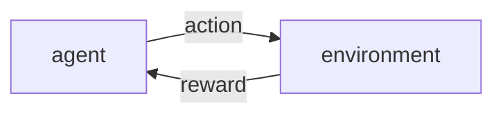

---
alias:
    ['bandit problem']
---
- 環境 environment
- 仲介者 agent
- 行動 action
- 報酬 reward

- 行動価値 action value
    - 標本平均 sample average
        $$
        Q_n = \frac{\sum_{i=1}^n R_i}{n} \\ Q_{n-1} = \frac{\sum_{i=1}^{n-1} R_i}{n-1} \\
        nQ_n = (n-1)Q_n + R_n \\
        Q_n = Q_{n-1}-\frac{Q_{n-1}}{n} + \frac{R_n}{n} \\
        Q_n = Q_{n-1} + \frac{1}{n}(R_n - Q_{n-1})
        $$
        定常問題を解く際に使われる
    - exponential moving average
        $$
        Q_n = Q_{n-1} + \alpha(R_n - Q_{n-1})
        $$
        非定常問題を解く際に使われる
- bandit(environment)
    the machine to return win(1) or lose(0) with the win rate
    endogenous: win rate of a bandit
    return: win or lose
- $\epsilon$-greedy method(agent)
    probability of $\epsilon$ : play the other bandit
    probability of $1-\epsilon$ : play argmax bandit