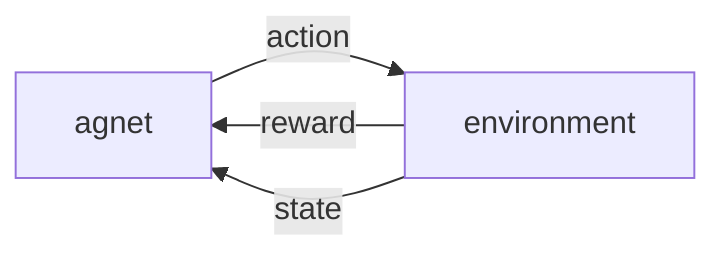

---
alias:
    ['MDP', 'Markov Decision Process']
---

- state $S = \{S_1, S_2, ...\}$
- action $A = \{A_1, A_2, ...\}$
- reward $R = \{R_1, R_2, ...\}$
- state transition probability
    $$
    p(s_{t+1} | s_t, a_t)
    $$
- reward function
    $$
    r_{t+1} = r(s_{t+1}, s_t, a_t)
    $$
- return
    $$
    G_t = \sum_{k = t}^\infty d^{k-t}R_t
    $$
- state value function